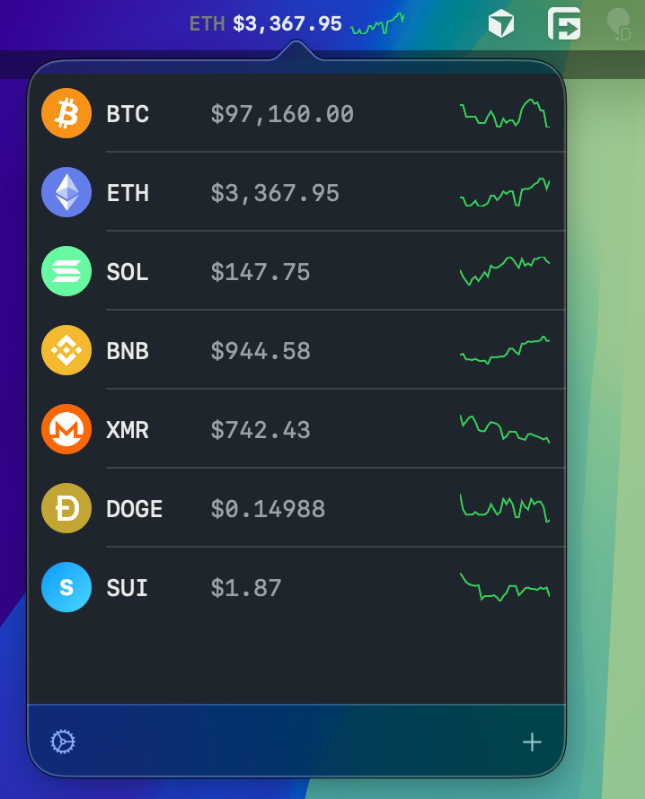
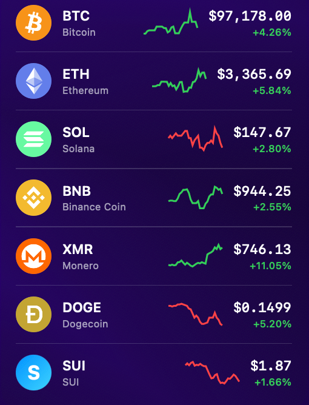

# CryptoTokenBar

A macOS menu bar app for real-time cryptocurrency price tracking.

<p align="center">
  
  &nbsp;&nbsp;&nbsp;
  
</p>

## Features

- **Menu Bar Display** - Price carousel with sparkline charts
- **Desktop Overlay** - Draggable, resizable floating window
- **Real-time Updates** - Live prices via Binance Futures WebSocket
- **Sparkline Charts** - Visual price history for each token
- **Multi-Screen Support** - Independent overlay per display
- **Fullscreen Aware** - Auto-collapse overlay in fullscreen apps
- **FX Conversion** - USDT/USDC rates via Coinbase

## Keyboard Shortcuts

| Shortcut | Action |
|----------|--------|
| `⌘ O` | Toggle desktop overlay |
| `⌘ Q` | Quit application |
| `⌥ Option` | Show/hide overlay (hold) |

## Mouse Controls

| Action | Effect |
|--------|--------|
| **Drag window** | Move overlay position |
| **Scroll wheel** | Zoom overlay (0.6x - 1.5x) |
| **Drag token icon** | Reorder tokens in list |

## Requirements

- macOS 15.0+
- Xcode 16.0+
- Swift 6

## Installation

Download the latest DMG from [Releases](https://github.com/cpkt9762/CryptoTokenBar/releases).

## Build

```bash
xcodebuild -project CryptoTokenBar.xcodeproj -scheme CryptoTokenBar -configuration Release build
```

## License

MIT
